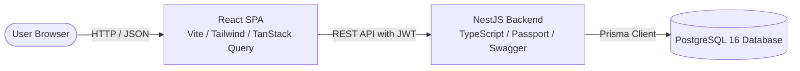

# Architecture

SimpleInvoice is structured as a full-stack monorepo with separated frontend and backend services sharing a PostgreSQL database.



---

## Repository Layout

```
SimpleInvoice/
├── backend/                  # NestJS 10 API
│   ├── prisma/               # Schema, migrations, Prisma client
│   ├── src/
│   │   ├── auth/             # JWT authentication, guards, strategy
│   │   ├── common/           # Decorators, filters, guards, interfaces
│   │   ├── database/         # Database seed script
│   │   ├── invoices/         # Invoices controller, service, DTOs
│   │   │   └── engine/       # Pure calculation engine
│   │   └── prisma/           # Prisma service integration
│   └── test/                 # E2E integration test suite
├── frontend/                 # Vite + React 19 Single Page Application
│   └── src/
│       ├── components/       # UI primitives, form widgets, layout
│       ├── context/          # Auth context and token management
│       ├── pages/            # Login, List, Detail, Create views
│       ├── services/         # Axios API client and TanStack Query hooks
│       └── types/            # TypeScript models and Zod schemas
├── docs/                     # Technical documentation
└── docker-compose.yml        # Docker orchestration file
```

---

## Technology Stack

| Layer | Technology | Purpose |
| :--- | :--- | :--- |
| **Frontend** | React 19 + Vite 6 | Fast single-page application UI |
| | TanStack Query v5 | Server-state caching and synchronization |
| | Tailwind CSS v4 | Responsive utility styling |
| | Zod | Client-side form validation |
| **Backend** | NestJS 10 + TypeScript | Modular REST API service |
| | Passport + JWT | Stateless bearer token authentication |
| | class-validator | Request payload validation |
| | Swagger / OpenAPI | Auto-generated interactive API docs |
| **Database** | PostgreSQL 16 + Prisma 6 | Relational data persistence and migrations |
| **Containers**| Docker + Docker Compose | Multi-container local execution |

---

## Key Design Decisions

### 1. Read-Time Overdue Status Derivation
- **Decision:** The database only stores `Draft`, `Pending`, or `Paid`. `Overdue` is never stored in the database.
- **Why:** Storing "Overdue" requires background cron jobs or database triggers to update records as time passes. This introduces clock skew and stale data.
- **How it works:**
  - When returning invoices, the server checks: if `status !== 'Paid'` and `dueDate < today`, it returns `Overdue`.
  - When filtering by `status=Overdue`, the database query searches for `dueDate < CURRENT_DATE AND status != 'Paid'`.

### 2. Server-Side Financial Calculations
- **Decision:** All financial values (`subTotal`, `taxAmount`, `totalAmount`, `balanceAmount`) are computed strictly on the backend.
- **Why:** Prevents client-side manipulation and ensures consistent precision across all records.
- **Implementation:** A pure domain calculation engine in `backend/src/invoices/engine/invoice-calculations.ts` handles all math with rounding to 2 decimal places. The frontend mirrors this formula only for live user previews before submitting.

### 3. Customer Upsert Pattern
- **Decision:** Customers are stored in a dedicated `customers` table, separate from `invoices`.
- **Why:** Avoids data duplication across multiple invoices issued to the same customer.
- **Behavior:** When creating an invoice with an email address:
  - If a customer with that email exists, the invoice links to that customer record.
  - If no customer exists, a new customer record is created within the same database transaction.

### 4. Global Validation and Error Envelope
- **Decision:** All requests pass through NestJS `ValidationPipe` with `whitelist: true` and `forbidNonWhitelisted: true`.
- **Envelope:** All errors return a uniform JSON format:
  ```json
  {
    "statusCode": 400,
    "message": ["dueDate must be on or after invoiceDate"],
    "error": "Bad Request"
  }
  ```
