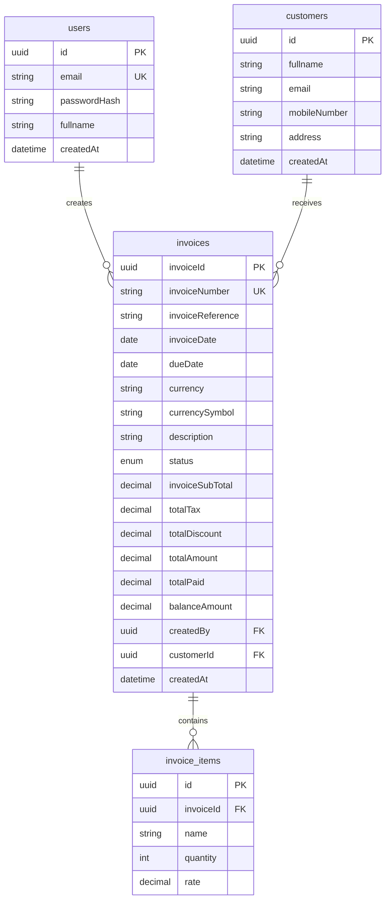

# Database Schema

SimpleInvoice uses **PostgreSQL 16** managed via **Prisma ORM**.

## Entity Relationship Diagram



---

## Tables & Models

### 1. `users`
Stores user credentials for application access.

| Column | Type | Constraints | Description |
| :--- | :--- | :--- | :--- |
| `id` | `UUID` | Primary Key | Generated UUID |
| `email` | `String` | Unique, Not Null | Login identifier |
| `passwordHash` | `String` | Not Null | Bcrypt hashed password |
| `fullname` | `String` | Not Null | Display name |
| `createdAt` | `DateTime` | Default `now()` | Account creation timestamp |

---

### 2. `customers`
Stores customer details linked to invoices.

| Column | Type | Constraints | Description |
| :--- | :--- | :--- | :--- |
| `id` | `UUID` | Primary Key | Generated UUID |
| `fullname` | `String` | Not Null | Customer full name |
| `email` | `String` | Not Null | Customer contact email |
| `mobileNumber` | `String` | Nullable | Optional phone number |
| `address` | `String` | Nullable | Optional billing address |
| `createdAt` | `DateTime` | Default `now()` | Customer creation timestamp |

---

### 3. `invoices`
Stores primary invoice financial and metadata records.

| Column | Type | Constraints | Description |
| :--- | :--- | :--- | :--- |
| `invoiceId` | `UUID` | Primary Key | Generated UUID |
| `invoiceNumber` | `String` | Unique, Not Null | User-supplied invoice number |
| `invoiceReference`| `String` | Nullable | External reference identifier |
| `invoiceDate` | `Date` | Not Null | Invoice issue date |
| `dueDate` | `Date` | Not Null | Payment due date (`>= invoiceDate`) |
| `currency` | `String` | Default `'AUD'` | ISO currency code |
| `currencySymbol` | `String` | Default `'AU$'` | Display currency symbol |
| `description` | `String` | Nullable | Notes or invoice description |
| `status` | `Enum` | Default `'Draft'` | Persisted status (`Draft`, `Pending`, `Paid`) |
| `invoiceSubTotal` | `Decimal(12,2)`| Not Null | Computed: `quantity * rate` |
| `totalTax` | `Decimal(12,2)`| Not Null | Computed: `subTotal * (taxPercent / 100)` |
| `totalDiscount` | `Decimal(12,2)`| Default `0` | Applied discount amount |
| `totalAmount` | `Decimal(12,2)`| Not Null | Computed: `subTotal + tax - discount` |
| `totalPaid` | `Decimal(12,2)`| Default `0` | Amount paid to date |
| `balanceAmount` | `Decimal(12,2)`| Not Null | Computed: `totalAmount - totalPaid` |
| `createdBy` | `UUID` | Foreign Key (`users.id`) | Restrict on delete |
| `customerId` | `UUID` | Foreign Key (`customers.id`) | Restrict on delete |
| `createdAt` | `DateTime` | Default `now()` | Record creation timestamp |

> **Note on Status:** `Overdue` is never stored in this table. It is derived at query time based on `dueDate` and `status != 'Paid'`.

---

### 4. `invoice_items`
Stores line items belonging to an invoice.

| Column | Type | Constraints | Description |
| :--- | :--- | :--- | :--- |
| `id` | `UUID` | Primary Key | Generated UUID |
| `invoiceId` | `UUID` | Foreign Key (`invoices.invoiceId`) | Cascade on delete |
| `name` | `String` | Not Null | Item or service description |
| `quantity` | `Int` | Not Null | Quantity (`>= 1`) |
| `rate` | `Decimal(12,2)` | Not Null | Unit rate / price (`> 0`) |

---

## Database Indexes

To support fast queries, searching, sorting, and pagination, the following indexes are configured:

- `invoices(invoiceNumber)` (Unique index)
- `invoices(invoiceDate)`
- `invoices(dueDate)`
- `invoices(status)`
- `invoices(customerId)`
- `invoices(createdBy)`
- `invoice_items(invoiceId)`

---

## Seeding & Migrations

### Migrations
Applied using Prisma Migrate:
```bash
yarn db:deploy
```

### Seeding
Populates the database with initial reviewer credentials and diverse test data:
```bash
yarn seed
```

The seed script creates:
1. **Reviewer user:** `reviewer@simpleinvoice.dev` (`Password123!`)
2. **Appendix A benchmark invoice:** `IV1780488206995` for customer Paul
3. **30+ realistic invoices:** Varied statuses (`Draft`, `Pending`, `Paid`), varied dates, amounts, and customers for testing pagination, sorting, and filters.
